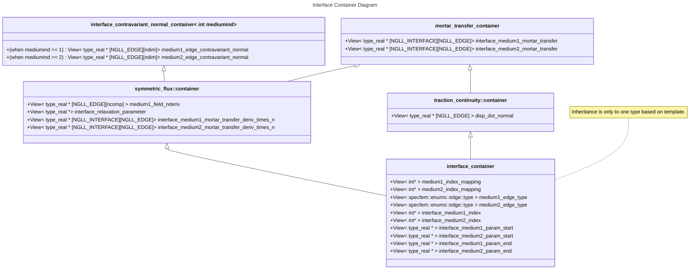

# Loosely Coupled Interfaces

This plan lays out the process for implementing loosely coupled interfaces.

## Prior Status

Currently, code resides in `edge_storages.hpp/tpp`. The following structs are used:

- `quadrature_rule` stores the knots, weights, and Lagrange Polynomial coefficients. Currently, GLL is used, but there should be no issue using other quadratures (GL).
- `edge` stores the `ispec` and `edge::type` of any given edge.
- `edge_data<ngllcacpacity,datacapacity>` stores the data for an edge. It is templated on the memory size.
- `edge_intersection<ngllcapacity>` stores data on each intersection. These are things like mortar transfers. Templating is just for memory size.
- `edge_storage<ngllcapacity,datacapacity>` stores all the preceding structs for an assembly. This is responsible for
  - building the `edge_data` array from the collection of edges.
  - providing for-each loops on both the edges and intersections.

## Implementation Plan

### Phase 1 (complete)

Create an integration test to one-click verify that the simulation is the same. Provenance dump files are the fastest way of doing this. Create a Python script to

- for-each scenario (acoustic-elastic, acoustic-acoustic, etc.) spawn a new run process
- As the dump files are generated, compare against the provenance files.
- if an error exceeds a tolerance, error out

### Phase 2

Migrate edge and intersection structs to `loosely_coupled_interface_container<MediumTag1, MediumTag2, Quadrature>`. This is the dG allegory to `interface_container<MediumTag1, MediumTag2>`.

Currently, the struct layout should be confirmed before moving onto edge/point access.

- [ ] Confirm flux class inheritance tree
- [ ] Confirm templates (should we incorporate tags like an/isotropic and boundary tag?)

The old edge data structs have been retired by replacing the old kernels with temporary primitive on-host only kernels that operate on the new containers. These primitive kernels work directly with the views, and much of the code is very verbose and absolutely awful. We can use these to design the load/store accessors, which is why they were made while technically part of [phase 3](#marker_phase3).

Modifications have been made in `include/compute/coupled_interfaces/loose_couplings` and `include/coupled_interface/loose/fluxes`. The main class is [`specfem::compute::loose::interface_container`](https://github.com/int-ptr-ptr/SPECFEMPP/blob/dg-phase2/include/compute/coupled_interfaces/loose_couplings/interface_container.hpp), which is templated off of dimension, medium tags on each side, quadrature type, and flux scheme. The flux schemes are stored in [`include/coupled_interface/loose/fluxes`](https://github.com/int-ptr-ptr/SPECFEMPP/tree/dg-phase2/include/coupled_interface/loose/fluxes). Each one must define a `<flux_type>::container` struct, templated off of dimension, medium tags on each side, and quadrature type, for which `interface_container` can inherit from. `HostMirror` views in the diagram below are omitted for brevity.



##### <a id=interfacedoc_interface_container href="https://github.com/int-ptr-ptr/SPECFEMPP/blob/dg-phase2/include/compute/coupled_interfaces/loose_couplings/interface_container.hpp">`interface_container`</a>

```C++
template <specfem::dimension::type DimensionType,
          specfem::element::medium_tag MediumTag1,
          specfem::element::medium_tag MediumTag2,
          typename QuadratureType,
          typename FluxScheme>
struct specfem::compute::loose::interface_container :
            FluxScheme::container<DimensionType, MediumTag1, MediumTag2, QuadratureType>
```

- [ ] Consider using an enum for `FluxScheme`. Should we do that?
- [ ] Finalize file path
- [ ] Finalize namespace

##### <a id=interfacedoc_interface_contravariant_normal_container href="https://github.com/int-ptr-ptr/SPECFEMPP/blob/dg-phase2/include/compute/coupled_interfaces/loose_couplings/interface_geometry.hpp">`interface_contravariant_normal_container`</a>

```C++
template <specfem::dimension::type DimensionType,
          typename QuadratureType,
          int medium,
          bool normalize>
struct specfem::compute::loose::interface_contravariant_normal_container;
```

This has either member `medium1_edge_contravariant_normal` or `medium2_edge_contravariant_normal` depending on what `medium` is. If the normal on either side is desired, one can extend two instances of this struct. These are all computed in the inline `specfem::compute::loose::compute_geometry` function in the same file, which should be called once before the time loop.

`normalize` specifies whether the normal should have magnitude 1 (in Euclidean/global space). If false, the length of the normal vector is set to the edge (1d) Jacobian.

- [ ] Confirm `InterfaceQuadrature`: Do we want all interfaces to be based on the same quadrature rule, or should we have different quadrature types/orders depending on the size of the interface relative to the element?
- [ ] Finalize file path
- [ ] Finalize namespace
- [ ] FInalize location (file/namespace) of `compute_geometry`. Should it be considered part of kernels?

##### <a id=interfacedoc_mortar_transfer_container href="https://github.com/int-ptr-ptr/SPECFEMPP/blob/dg-phase2/include/compute/coupled_interfaces/loose_couplings/interface_quadrature.hpp">`mortar_transfer_container`</a>

```C++
template< typename EdgeQuadrature, typename InterfaceQuadrature>
struct specfem::coupled_interface::loose::quadrature::mortar_transfer_container
```

- [ ] Confirm `InterfaceQuadrature`: Do we want all interfaces to be based on the same quadrature rule, or should we have different quadrature types/orders depending on the size of the interface relative to the element?
- [ ] Finalize file path
- [ ] Finalize namespace

##### <a id=interfacedoc_symmetric_flux_container href="https://github.com/int-ptr-ptr/SPECFEMPP/blob/dg-phase2/include/compute/coupled_interfaces/loose_couplings/symmetric_flux_container.hpp">`symmetric_flux::container`</a>

```C++
template <specfem::dimension::type DimensionType, typename QuadratureType>
struct specfem::coupled_interface::loose::flux::symmetric_flux::container<
          DimensionType,
          {acoustic/elastic},
          {acoustic/elastic},
          QuadratureType> :
      specfem::coupled_interface::loose::quadrature::mortar_transfer_container<QuadratureType, QuadratureType>,
      specfem::compute::loose::interface_contravariant_normal_container<DimensionType, QuadratureType, 1, true>,
      specfem::compute::loose::single_medium_interface_container
```

Populates the template member type of the following struct ([link](https://github.com/int-ptr-ptr/SPECFEMPP/blob/dg-phase2/include/coupled_interface/loose/fluxes/symmetric_flux.hpp)).

```C++
struct specfem::coupled_interface::loose::flux::symmetric_flux {

  template <specfem::dimension::type DimensionType,
            specfem::element::medium_tag MediumTag1,
            specfem::element::medium_tag MediumTag2, typename QuadratureType>
  struct container;
  ...
}
```

The extension of `specfem::compute::loose::single_medium_interface_container` ([link](https://github.com/int-ptr-ptr/SPECFEMPP/blob/dg-phase2/include/compute/coupled_interfaces/loose_couplings/interface_container.hpp)) acts as a flag for when medium1 and medium2 should be treated the same (`medium1_index_mapping = medium2_index_mapping`). Edge 1 and 2 views are set to be the same to not waste space, and any loop over all edges (on either side of the interface) will ignore medium 2.

- [ ] This scheme currently extends `mortar_transfer_container` with `InterfaceQuadrature = EdgeQuadrature = QuadratureType`. Keep this as is, or should we try to allow `InterfaceQuadrature` to be something like a GL quadrature?
- [ ] Finalize file path for container
- [ ] Finalize namespace for container (we may want to migrate away from the current struct template-member scheme)
- [ ] Finalize format of `specfem::compute::loose::single_medium_interface_container` flag. Should it be a `static constexpr bool` or something?

##### <a id=interfacedoc_traction_continuity_container href="https://github.com/int-ptr-ptr/SPECFEMPP/blob/dg-phase2/include/compute/coupled_interfaces/loose_couplings/traction_continuity_container.hpp">`traction_continuity::container`</a>

```C++
template <specfem::dimension::type DimensionType, typename QuadratureType>
struct specfem::coupled_interface::loose::flux::traction_continuity::container<
          DimensionType,
          specfem::element::medium_tag::acoustic,
          specfem::element::medium_tag::elastic,
          QuadratureType> :
    specfem::coupled_interface::loose::quadrature::mortar_transfer_container<QuadratureType, QuadratureType>,
    specfem::compute::loose::interface_normal_container<DimensionType, QuadratureType, 2, true>
```

Populates the template member type of the following struct ([link](https://github.com/int-ptr-ptr/SPECFEMPP/blob/dg-phase2/include/coupled_interface/loose/fluxes/traction_continuity.hpp)).

```C++
struct specfem::coupled_interface::loose::flux::traction_continuity {

  template <specfem::dimension::type DimensionType,
            specfem::element::medium_tag MediumTag1,
            specfem::element::medium_tag MediumTag2, typename QuadratureType>
  struct container;
  ...
}
```

- [ ] This scheme currently extends `mortar_transfer_container` with `InterfaceQuadrature = EdgeQuadrature = QuadratureType`. Keep this as is, or should we try to allow `InterfaceQuadrature` to be something like a GL quadrature?
- [ ] Finalize file path for container
- [ ] Finalize namespace for container (we may want to migrate away from the current struct template-member scheme)

### Phase 3 <span id="marker_phase3"></span>

Migrate the for-each kernels to a Kokkos for-each. See `include/coupled_interface/coupled_interface.tpp` and `include/coupled_interface/impl/compute_coupling.hpp`.

#### Status (Phase 3)

As for now, primitive kernels are defined in the `FluxScheme` types ([here](https://github.com/int-ptr-ptr/SPECFEMPP/blob/dg-phase2/include/coupled_interface/loose/fluxes/symmetric_flux.hpp) and [here](https://github.com/int-ptr-ptr/SPECFEMPP/blob/dg-phase2/include/coupled_interface/loose/fluxes/traction_continuity.hpp)), looping on-host with the phase 2 structs. Their formatting should be finalized before incorporating on-device loops.

### Phase 4

! We first need to figure out the best way to store kernels that may be inter-assembly.
