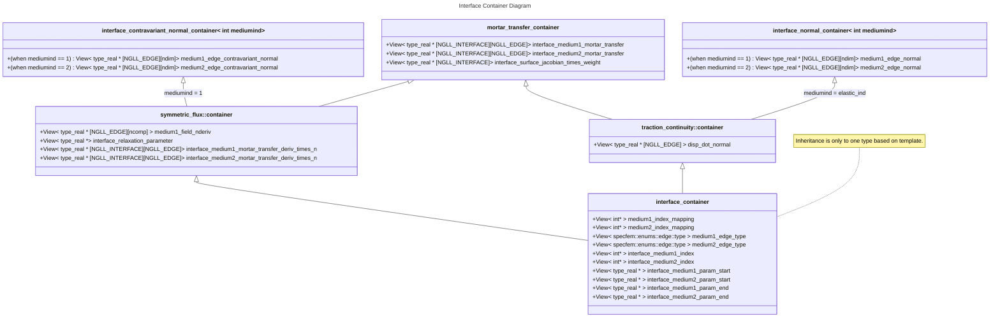

# Loosely Coupled Interfaces

This plan lays out the process for implementing loosely coupled interfaces.

## Prior Status

Currently, code resides in `edge_storages.hpp/tpp`. The following structs are used:

- `quadrature_rule` stores the knots, weights, and Lagrange Polynomial coefficients. Currently, GLL is used, but there should be no issue using other quadratures (GL).
- `edge` stores the `ispec` and `edge::type` of any given edge.
- `edge_data<ngllcacpacity,datacapacity>` stores the data for an edge. It is templated on the memory size.
- `edge_intersection<ngllcapacity>` stores data on each intersection. These are things like mortar transfers. Templating is just for memory size.
- `edge_storage<ngllcapacity,datacapacity>` stores all the preceding structs for an assembly. This is responsible for
  - building the `edge_data` array from the collection of edges.
  - providing for-each loops on both the edges and intersections.

## Implementation Plan

### Phase 1 (complete)

Create an integration test to one-click verify that the simulation is the same. Provenance dump files are the fastest way of doing this. Create a Python script to

- for-each scenario (acoustic-elastic, acoustic-acoustic, etc.) spawn a new run process
- As the dump files are generated, compare against the provenance files.
- if an error exceeds a tolerance, error out

### Phase 2

Migrate edge and intersection structs to `loosely_coupled_interface_container<MediumTag1, MediumTag2, Quadrature>`. This is the dG allegory to `interface_container<MediumTag1, MediumTag2>`.

Currently, the struct layout should be confirmed before moving onto edge/point access.

- [ ] Confirm flux class inheritance tree
- [ ] Confirm templates (should we incorporate tags like an/isotropic and boundary tag, or can we keep that to the kernels?)
- [ ] Decide on design for `InterfaceQuadrature` ([elaboration](#interfacedoc_mortar_transfer_container)).

The old edge data structs have been retired by replacing the old kernels with temporary primitive on-host only kernels that operate on the new containers. These primitive kernels work directly with the views, and much of the code is very verbose and absolutely awful. We can use these to design the load/store accessors, which is why they were made while technically part of [phase 3](#marker_phase3).

Loosely coupled interface storage structures are kept to a somewhat similar format to their strongly coupled counterparts: Two media are joined together, where each `ispec` populates `medium(1/2)_index_mapping` and edge populates `medium(1/2)_edge_type`. Conformal interfaces make the correspondence between either side implicitly well-defined, but we do not have the same situation for the loosely coupled interfaces. Instead, there are a collection of intersections (interfaces) where two elements share a section of edge along a contiguous path. Each interface links to an edge (an integer index for `medium(1/2)_index_mapping`, etc.). It is expected that a quadrature is performed on each of these interfaces, and added to acceleration terms for each shape function that admits a nonzero value to that integral. In the case that one may want to have a loosely coupled interface without a clear side-1 / side-2 distinction (for example, if every element is detached from its neighbor), we can use a single medium view that is referenced by either side of each entry in the interface collection.

Modifications have been made in `include/compute/coupled_interfaces/loose_couplings` and `include/coupled_interface/loose/fluxes`. The main class is [`specfem::compute::loose::interface_container`](https://github.com/int-ptr-ptr/SPECFEMPP/blob/dg-phase2/include/compute/coupled_interfaces/loose_couplings/interface_container.hpp), which is templated off of dimension, medium tags on each side, quadrature type, and flux scheme. The flux schemes are stored in [`include/coupled_interface/loose/fluxes`](https://github.com/int-ptr-ptr/SPECFEMPP/tree/dg-phase2/include/coupled_interface/loose/fluxes). Each one must define a `<flux_type>::container` struct, templated off of dimension, medium tags on each side, and quadrature type, for which `interface_container` can inherit from. `HostMirror` views in the diagram below are omitted for brevity.



#### <a id=interfacedoc_interface_container href="https://github.com/int-ptr-ptr/SPECFEMPP/blob/dg-phase2/include/compute/coupled_interfaces/loose_couplings/interface_container.hpp">`interface_container`</a>

```C++

template <specfem::dimension::type DimensionType,
          specfem::element::medium_tag MediumTag1,
          specfem::element::medium_tag MediumTag2,
          typename QuadratureType,
          specfem::coupled_interface::loose::flux::type FluxSchemeType>
struct interface_container :
            specfem::coupled_interface::loose::flux::FluxScheme<FluxSchemeType>
          ::ContainerType<DimensionType, MediumTag1, MediumTag2, QuadratureType>
```

This is the "base" container. All containers are of this type, but the `FluxSchemeType` template parameter sets the base class. This choice to have the "base" container as a derived class allows for the visibility of everything through a single templated type without the need for static casts, which may or may not be needed. The variables that are necessary for every interface are stored here. As an exception, if `specfem::compute::loose::single_medium_interface_container` is a base class, `medium2_index_mapping`, `medium2_edge_type`, etc. are technically not needed, but instead of removing them, the views are set to their medium-1 counterparts, so they point to the same data.

- [x] Consider using an enum for `FluxScheme`. ~~Should we do that?~~ *swapped to en enum*
- [ ] "This choice to have the "base" container as a derived class allows for the visibility of everything through a single templated type without the need for static casts, which may or may not be needed" -- confirm if this design choice was a good idea.
- [ ] The way `single_medium_interface_container` is implemented is a bit awkward. Should it be changed?
- [ ] Finalize file path
- [ ] Finalize namespace

#### <a id=interfacedoc_interface_normal_container href="https://github.com/int-ptr-ptr/SPECFEMPP/blob/dg-phase2/include/compute/coupled_interfaces/loose_couplings/interface_geometry.hpp">`interface_normal_container`</a>

```C++
template <specfem::dimension::type DimensionType,
          typename QuadratureType,
          int medium,
          bool normalize>
struct specfem::compute::loose::interface_normal_container;
```

This struct precomputes and stores the normal along a given edge. A flux scheme's container may choose to store only one side's normal (for example, `traction_continuity` requires only the normal on the elastic side).

This has either member `medium1_edge_normal` or `medium2_edge_normal` depending on what `medium` is. If the normal on either side is desired, one can extend two instances of this struct. These are all computed in the inline `specfem::compute::loose::compute_geometry` function in the same file, which should be called once before the time loop.

`normalize` specifies whether the normal should have magnitude 1 (in Euclidean/global space). If false, the length of the normal vector is set to the edge (1d) Jacobian.

- [ ] Should we include the `normalize` parameter? This is a vestigial artifact from the formal kernel (now dead), where the Jacobian was included to simplify the code. This only works when the edges are linear, though, since the Jacobian on the edge is not mapped simply to the Jacobian on the interface, due to the potential 1d-coordinate reparameterization. For now, every struct implements the normal containers with `normalize=true`, and I cannot forsee any time when that will not be the case.
- [ ] Finalize file path
- [ ] Finalize namespace
- [ ] FInalize location (file/namespace) of `compute_geometry`. Should it be considered part of kernels?

#### <a id=interfacedoc_interface_contravariant_normal_container href="https://github.com/int-ptr-ptr/SPECFEMPP/blob/dg-phase2/include/compute/coupled_interfaces/loose_couplings/interface_geometry.hpp">`interface_contravariant_normal_container`</a>

```C++
template <specfem::dimension::type DimensionType,
          typename QuadratureType,
          int medium,
          bool normalize>
struct specfem::compute::loose::interface_contravariant_normal_container;
```

This is similar to `interface_normal_container`, except the precomputation includes the multiplication by the adjoint of the deformation gradient, as to facilitate the contraction with the local coordinate gradient. Effectively, what is stored is the normal vector field (not the 1-form) in local coordinate space.

This has either member `medium1_edge_contravariant_normal` or `medium2_edge_contravariant_normal` depending on what `medium` is. If the normal on either side is desired, one can extend two instances of this struct. These are all computed in the inline `specfem::compute::loose::compute_geometry` function in the same file, which should be called once before the time loop.

- [ ] Confirm if this should be its own struct, or a template flag for `interface_normal_container`. We probably don't need the last one, but we could template off of an enum with values `{GLOBAL, LOCAL_CONTRAVARIANT, LOCAL_COVARIANT}`.
- [ ] Finalize file path
- [ ] Finalize namespace

#### <a id=interfacedoc_mortar_transfer_container href="https://github.com/int-ptr-ptr/SPECFEMPP/blob/dg-phase2/include/compute/coupled_interfaces/loose_couplings/interface_quadrature.hpp">`mortar_transfer_container`</a>

```C++
template< typename EdgeQuadrature, typename InterfaceQuadrature>
struct specfem::coupled_interface::loose::quadrature::mortar_transfer_container
```

This struct holds the necessary mechanisms to convert edge values to mortar values through interpolation, and perform a quadrature on the interface. We store per-interface the mortar transfer tensor (for the evaluation at mortar knots) and the 1d Jacobian of the edge.

As for now, the edge quadrature and interface quadrature are the same, but we may wish to utilize GL quadrature on the interface, since we only need it to compute integrals (we do not need knots on the boundaries). The quadrature scheme for the interface integrals can be trivially divorced from the mesh GLL quadrature (GL gives a +2 order or -2 nodes at same order). `typename InterfaceQuadrature` is the template parameter for this, so we have flexibility on the quadrature struct design. One design issue arises, however: where would we store the `InterfaceQuadrature` instance for the kernel? `EdgeQuadrature` can just copy from `assembly.mesh.quadratures`, but we need a place to keep the `InterfaceQuadrature` instance. Alternatively, one can set the quadrature constants all to static-scope access, removing the need for a struct instance.

- [ ] Ostensibly, every flux scheme should be performing a quadrature on the interface level instead of the edge level, due to only $C^{0}$ continuity between edges (or no continuity if it is across a dG edge). Because of this, we may want to merge `mortar_transfer_container` into `interface_container` instead of having every container extending `mortar_transfer_container`. Confirm what to do.
- [ ] Confirm `InterfaceQuadrature`: Do we want all interfaces to be based on the same quadrature rule, or should we have different quadrature types/orders depending on the size of the interface relative to the element? Since `InterfaceQuadrature` names a type, we could also have it refer to a family of quadratures that we swap between depending on desired integral order on a per-interface basis.
- [ ] Currently, the knots for the interface quadrature are chosen to be as close to a constant-speed parameterization as possible. If we finalize this choice, then we can treat the interface Jacobian as constant, and store 1 value per interface instead of `NGLL` values. That being said, when we move to 3D, we will not have that freedom (at least I don't think we do), so we may want to keep the storage as is. Confirm ths.
- [ ] Finalize file path
- [ ] Finalize namespace

#### <a id=interfacedoc_symmetric_flux_container href="https://github.com/int-ptr-ptr/SPECFEMPP/blob/dg-phase2/include/compute/coupled_interfaces/loose_couplings/symmetric_flux_container.hpp">`symmetric_flux::container`</a>

```C++
template <specfem::dimension::type DimensionType, typename QuadratureType>
struct specfem::compute::loosely_coupled_interface::symmetric_flux_container<
          DimensionType,
          {acoustic/elastic},
          {acoustic/elastic},
          QuadratureType> :
      specfem::coupled_interface::loose::quadrature::mortar_transfer_container<QuadratureType, QuadratureType>,
      specfem::compute::loose::interface_contravariant_normal_container<DimensionType, QuadratureType, 1, true>,
      specfem::compute::loose::single_medium_interface_container
```

This is the Grote flux that was used in the initial dG implementation. This is used when `MediumTag1 == MediumTag2`, but since the template of `FluxScheme::container` must always be of a certain format, the above is fixed. The word "symmetric" refers not to the medium1-medium2 symmetry, but the symmetry of the bilinear form that makes up the mass matrix.

The extension of `specfem::compute::loose::single_medium_interface_container` ([link](https://github.com/int-ptr-ptr/SPECFEMPP/blob/dg-phase2/include/compute/coupled_interfaces/loose_couplings/interface_container.hpp)) acts as a flag for when medium1 and medium2 should be treated the same (`medium1_index_mapping = medium2_index_mapping`). Edge 1 and 2 views are set to be the same to not waste space, and any loop over all edges (on either side of the interface) will ignore medium 2.

- [ ] This scheme currently extends `mortar_transfer_container` with `InterfaceQuadrature = EdgeQuadrature = QuadratureType`. Keep this as is, or should we try to allow `InterfaceQuadrature` to be something like a GL quadrature?
- [ ] Finalize file path for container
- [ ] Finalize namespace for container (we may want to migrate away from the current struct template-member scheme)
- [ ] Finalize format of `specfem::compute::loose::single_medium_interface_container` flag. Should it be a `static constexpr bool` or something?

#### <a id=interfacedoc_traction_continuity_container href="https://github.com/int-ptr-ptr/SPECFEMPP/blob/dg-phase2/include/compute/coupled_interfaces/loose_couplings/traction_continuity_container.hpp">`traction_continuity::container`</a>

```C++
template <specfem::dimension::type DimensionType, typename QuadratureType>
struct specfem::compute::loosely_coupled_interface::traction_continuity_container<
          DimensionType,
          specfem::element::medium_tag::acoustic,
          specfem::element::medium_tag::elastic,
          QuadratureType> :
    specfem::coupled_interface::loose::quadrature::mortar_transfer_container<QuadratureType, QuadratureType>,
    specfem::compute::loose::interface_normal_container<DimensionType, QuadratureType, 2, true>
```

`traction_continuity` follows the rules of Komatitsch & Tromp (cit) for the fluid-solid interface. In the traditional formulation, the boundary integrals are replaced with the corresponding traction values on the other side. This does not require conformal nodes, but the current SPECFEM implementation of it does. This implements those boundary integrals for non-conforming nodes configurations.

- [ ] This scheme currently extends `mortar_transfer_container` with `InterfaceQuadrature = EdgeQuadrature = QuadratureType`. Keep this as is, or should we try to allow `InterfaceQuadrature` to be something like a GL quadrature?
- [ ] Finalize file path for container
- [ ] Finalize namespace for container (we may want to migrate away from the current struct template-member scheme)

### Phase 3 <span id="marker_phase3"></span>

Migrate the for-each kernels to a Kokkos parfor. See `include/coupled_interface/coupled_interface.tpp` and `include/coupled_interface/impl/compute_coupling.hpp`.

As for now, primitive kernels are defined in the `FluxScheme` types, looping on-host with the phase 2 structs. Their formatting, as well as access structs should be finalized before incorporating on-device loops.

#### `symmetric_flux` kernels ([file link](https://github.com/int-ptr-ptr/SPECFEMPP/blob/dg-phase2/include/coupled_interface/loose/fluxes/symmetric_flux.hpp))

Currently, only the acoustic-acoustic kernel is written.

- `compute_relaxation_parameter(int interface_index)` - should be called once before the timeloop. Populates `interface_relaxation_parameter` for a given index with the value $\\alpha\\frac{\\max_{\\text{element}}\\rho^{-1}}{\\text{diam}(\\text{element})}$ for a constant value $\\alpha$ set by macro (for the time being).
- `compute_mortar_trans_deriv(int interface_index)` - should be called once before the timeloop. This computes the Lagrange polynomials' derivatives $L'(z)$ at the mortar points $z$ times the along-edge contravariant normal derivative at that point. This is a term in the flux that comes from the normal derivative of the test function.
- `compute_edge_intermediate(int edge_index)` - called once per time step. Computes the normal derivative of the field, utilizing the precomputed contravariant normal vector for the dot product.
- `compute_fluxes()` - Called once per time step. Computes the Grote symmetric flux for each interface. The implementation is wrong, just like the former implementation, since the symmetrization term (that takes the normal derivative of the test functions) should be nonzero for interior test functions, and I forgot to include them. This will be fixed later, when I revise my test suite.

#### `traction_continuity` kernels ([file link](https://github.com/int-ptr-ptr/SPECFEMPP/blob/dg-phase2/include/coupled_interface/loose/fluxes/traction_continuity.hpp))

- `compute_edge_intermediate(int edge_index)` - Called once per time step. Computes the displacement dot the normal (`disp_dot_normal`).
- `elastic_to_acoustic_accel()` - Called once per time step, before the acoustic wavefield gets updated. Uses the standard fluid-solid flux scheme to compute acoustic accelerations from `disp_dot_normal`.
- `acoustic_to_elastic_accel()` - Called once per time step, after the acoustic wavefield gets updated. Uses the standard fluid-solid flux scheme to compute elastic accelerations from the edge normal and acoustic acceleration.

### Phase 4

! We first need to figure out the best way to store kernels that may be inter-assembly.
