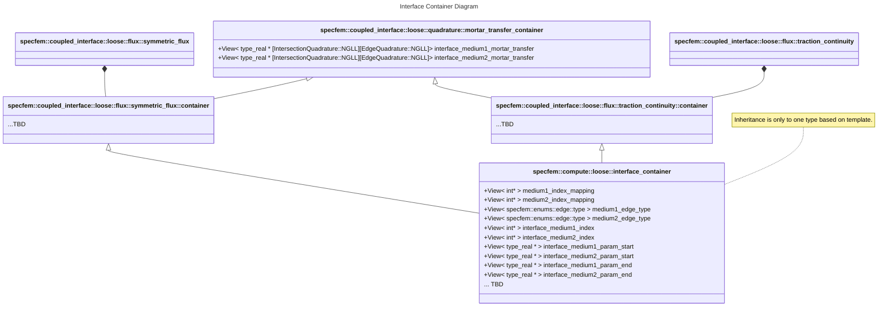

# Loosely Coupled Interfaces

This plan lays out the process for implementing loosely coupled interfaces.

## Prior Status

Currently, code resides in `edge_storages.hpp/tpp`. The following structs are used:

- `quadrature_rule` stores the knots, weights, and Lagrange Polynomial coefficients. Currently, GLL is used, but there should be no issue using other quadratures (GL).
- `edge` stores the `ispec` and `edge::type` of any given edge.
- `edge_data<ngllcacpacity,datacapacity>` stores the data for an edge. It is templated on the memory size.
- `edge_intersection<ngllcapacity>` stores data on each intersection. These are things like mortar transfers. Templating is just for memory size.
- `edge_storage<ngllcapacity,datacapacity>` stores all the preceding structs for an assembly. This is responsible for
  - building the `edge_data` array from the collection of edges.
  - providing for-each loops on both the edges and intersections.

## Implementation Plan

### Phase 1 (complete)

Create an integration test to one-click verify that the simulation is the same. Provenance dump files are the fastest way of doing this. Create a Python script to

- for-each scenario (acoustic-elastic, acoustic-acoustic, etc.) spawn a new run process
- As the dump files are generated, compare against the provenance files.
- if an error exceeds a tolerance, error out

### Phase 2

Migrate edge and intersection structs to `loosely_coupled_interface_container<MediumTag1, MediumTag2, Quadrature>`. This is the dG allegory to `interface_container<MediumTag1, MediumTag2>`.

From this, we can write load/store on host functions to interface with the current structs for a checkpoint.

With the restriction of quadrature rules to one per interface, and the media templating, we can finalize `ngllcapacity -> ngll1,ngll2` and fix the data container with the specific data that needs to be computed per interface type.

Our last checkpoint for this phase is to use load/store on host for the new structs with a helper function that converts them to the old structs to use the old for-each kernels.

#### Status

Modifications have been made in `include/compute/coupled_interfaces/loose_couplings` and `include/coupled_interface/loose/fluxes`. The main class is [`specfem::compute::loose::interface_container`](https://github.com/int-ptr-ptr/SPECFEMPP/blob/dg-phase2/include/compute/coupled_interfaces/loose_couplings/interface_container.hpp), which is templated off of dimension, medium tags on each side, quadrature type, and flux scheme. The flux schemes are stored in [`include/coupled_interface/loose/fluxes`](https://github.com/int-ptr-ptr/SPECFEMPP/tree/dg-phase2/include/coupled_interface/loose/fluxes). Each one must define a `<flux_type>::container` struct, templated off of dimension, medium tags on each side, and quadrature type, for which `interface_container` can inherit from. `HostMirror` views in the diagram below are omitted for brevity.

Additionally, for fluxes that require a quadrature on the intersection, the [`mortar_transfer_container`](https://github.com/int-ptr-ptr/SPECFEMPP/blob/dg-phase2/include/compute/coupled_interfaces/loose_couplings/interface_quadrature.hpp) struct is provided.

### Phase 3

Migrate the for-each kernels to a Kokkos for-each. See `include/coupled_interface/coupled_interface.tpp` and `include/coupled_interface/impl/compute_coupling.hpp`.

### Phase 4

! We first need to figure out the best way to store kernels that may be inter-assembly.
