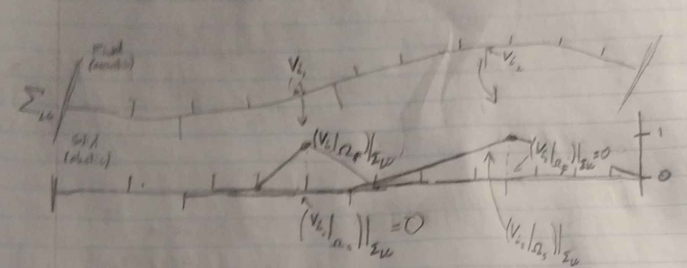
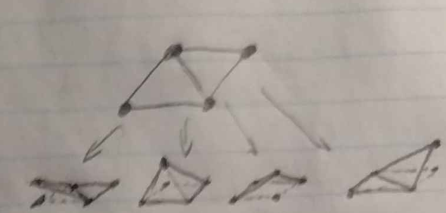
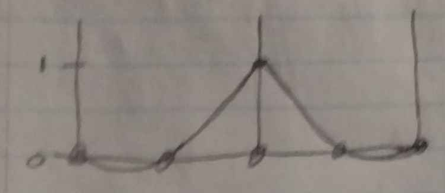
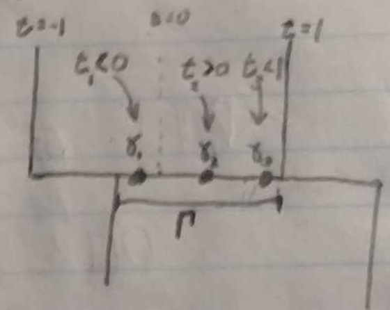

# Loosely Coupled Interfaces

Traditionally, the linear weak problem for the wave equation is given, for a solution $u$,

$$M(\tilde u, \ddot u) = K(\tilde u, u) + F(\tilde u),~~~~\forall \tilde u \in V$$

over some space of functions $V$. We call the $\tilde u$ test functions, which span $V$ in the sense of vector spaces. The basis of this space is specified by the mesh. $M$ and $K$ are bilinear forms (equivalently, matrices after specifying a basis), stemming from the integrals over the strong form of the PDE. $F$ comes from the force (source) terms, that do not depend on the field $u$. For nonconforming (loosely coupled) interfaces, the relevant quantity is an addend of $K$.

## Relevant Term in the PDE

We wish to compute the surface terms of the stiffness matrix corresponding to nonconforming edges (surfaces). Ultimately these form a bilinear form

$$B(\tilde u,u) = \int_{\Sigma_{LC}} b(\tilde u,u)~dS$$

for some pointwise form $b$, defined on the loosely coupled surface $\Sigma_{LC}$. Here $u$ is the field and $\tilde u$ is the test function.
By pointwise, we mean that $b$, at a point $\gamma\in \Sigma_{LC}$ is of the form

$$\big(b(\tilde u, u)\big)| _{\gamma} =: {\tilde b} _{\gamma}({\tilde u}| _{\Sigma _{LC}}(\gamma),u| _{\Sigma _{LC}}(\gamma))$$

It should be noted that the discontinuity across $\Sigma_{LC}$ admits two traces $(u| _ {\Omega_1})| _ {\Sigma _ {LC}}$ and $(u| _ {\Omega _ 2})| _ {\Sigma _ {LC}}$, where $\Omega_1$ and $\Omega_2$ represent the domains on either side of the interface, with $(\cdot)| _ {\Sigma_{LC}}$ representing their corresponding trace operators. Depending on the choice of flux scheme (and consequently integrand $b$), either or both traces may be used.

In the case of an acoustic-elastic interface as given by Komatitsch et al. (2000)[^1^](#komatitsch2000), this takes the form

$$b_{S\to F}(\tilde \chi,s) = \tilde \chi~(s\cdot \hat n)$$

$$b_{F\to S}(\tilde s,\chi) = -\tilde s \cdot (p \hat n) = -\tilde s \cdot (-\ddot\chi \hat n)$$

for pressure $p$, where we use a fluid potential formulation $s| _ {\Omega_F} = \rho^{-1}\nabla \chi$. We write $b _ {S\to F}$ to represent the integrand of the interface surface integral for the fluid domain, and $b_{F\to S}$ to represent that of the solid domain.
Splitting the domain into an elastic (solid) regime $\Omega_S$ and acoustic (fluid) regime $\Omega_F$ equates to defining $V$ as the direct sum of test functions in each regime:

$$V = V_S \oplus V_F\subseteq\\{\tilde s:\Omega_S \to \mathbb R^d\\}\oplus \\{\tilde \chi:\Omega_F \to \mathbb R\\}$$

From this formulation, the corresponding integrand is

$$b(\tilde s +\tilde \chi,s+\chi) = \tilde \chi~(s\cdot \hat n) - \tilde s \cdot (-\ddot\chi \hat n)$$

where the trace operators $((\chi+s)| _ {\Omega _ S})| _ {\Sigma _ {LC}} = s$ and $((\chi+s)| _ {\Omega _ F})| _ {\Sigma _ {LC}} = \chi$ are implied.



In the case of isoparametric elements over a Lagrange polynomial basis, there is a correspondence between nodes and test functions.



This figure demonstrates piecewise linear functions over a triangular mesh in 2D.

## Quadrature

This integral is computed by composite quadrature. We refer to the separation of the domain as the "mortar" that adheres the discontinuous elements.
I chose to separate this integral into regions by element corners. That is, every segment for quadrature is the connected intersection of two elements. There are two reasons for this choice:

- *Symmetry*: there is no dominant edge that the mortar inherits from. This is entirely a subjective, moral judgement.
- *Error Minimization*: If the integral is computed off of more than one element, then the field (and shape function) can only be guaranteed to be $C^0$-continuous, so the quadrature will have an error $O(h^2)$, regardless of the element order. If the elements are connected by a dG coupling, then we cannot even guarantee continuity, giving an $O(h)$ error.


Letting $I$ vary over the indices for which each test function

$$v_I \in \\{v_A\\}_{A\in \mathcal A}$$

(over some indexing set $\mathcal A$) has nonzero integral over a section
$\Gamma \subseteq \Sigma_{LC}$ of the interface, we compute the entries

$$B(v _ I,u) = \sum _ {k=1}^{N _ {quad}} w _ k J(\gamma _ k) b(v _ I| _ {\Gamma}(\gamma _ k),u| _ {\Gamma}(\gamma_k))$$

for weights $w_k$, knots $\gamma_k$, and surface (1d) Jacobian $J$.

From the choice of sections (intersections between two elements), $I$ varies across the corresponding edge on either side. If we wish to compute the flux terms on one side for a given intersection, we would see two for loops:

```pseudocode
for i = 1:nquad_edge
do
  Bi = 0;
  for k = 1:nquad_quad
  do
    Bi += w[k] * J[k] * b(v[i][k],u[k]);
  end
  FORCE[i] += Bi
end
```

`w[k]` and `J[k]` are the weights and Jacobian, which can be precomputed and stored as floats. $u(\gamma_k)$ and $v(\gamma_k)$ can be computed by interpolating the trace of the corresponding function. I refer to this process as the "mortar transfer".

### Mortar Transfers

We assume the trace of a field $f$ on a given element to its relevant edge is a linear combination of basis functions

$$f_\Gamma = {f_\Gamma}^i L_i. ~~~~~~~~~(*)$$

In the case of a basis defined by a tensor product $(L_i \otimes L_j)(x,y) = L_i(x)L_j(y)$ of Lagrange polynomials with a knot on the endpoints (for example, SEM[^1^](#komatitsch2000)), this is simply the Lagrange polynomials in the along-edge coordinate for endpoint (on the edge) nodes. For example, if index $i=1$ correspond to the edge that we want to map onto $\Gamma$, the trace of the basis function $L_i \otimes L_j$ will be

$$(L _ i \otimes L _ j)| _ {\Gamma} = \delta _ {i1} L _ j,$$

which allows any field $f$ to be represented as (\*) in a trivial way.
In general, every basis function may have a nonzero trace, but the trace mapping can always be represented as a linear surjection (to an equal or lower dimension) into the form (\*). As illustrated by Chan et al (2021)[^2^](#chan2021), this is particularly important to make explicit the trace operator for Gauss-Legendre quadrature, where basis functions are still of the form $L_i \otimes L_j$, but there are no endpoint nodes. Interpolating the basis functions at the mortar knots explicitly means interpolating $N_{quad}^2$ functions. If instead the trace was performed first, then we would only interpolate $N_{quad}$ functions.


Assuming $t_k$ are the knots of the mortar integral in the edge's coordinates, we can compute from (\*) the values of $f$ at the knots as follows:

$$f(\gamma_k) := f_\Gamma(\gamma_k) = {f_\Gamma}^i L_i(t_k).$$

Thus, if we have access to the "mortar transfer tensor" $L_i(t_k)$, we can compute $b(v_I(\gamma_k),u(\gamma_k))$ from their coefficients in $V$. Since the $t_k$ are in the edge's coordinates, they represent both the mortar's quadrature collocation points and the coordinate mapping between the edge's coordinates and the mortar coordinates (the latter defining the Jacobian $J$ and quadrature knots).



These values can be baked at mesh initialization and stored instead of the quadrature knots $t_k$ (which can be recovered via $t_k = z_iL_i(t_k)$, where $z_iL_i$ is the identity map). Alternatively, if the $L_i$ are the globally the same in each edge's local coordinates, one can store the $t_k$ and compute the mortar transfer tensor on the fly. The latter saves memory in exchange for extra computation, which may be better performant if memory reads are a bottleneck, since the cache line (or network bandwidth) is more efficiently utilized ($N_{quad}^2$ values for the tensor, but only $N_{quad}$ for the $t_i$).

## Citation Nodes

1) <a id="komatitsch2000" href="https://chooser.crossref.org/?doi=10.1190%2F1.1444758">Komatitsch, D., Barnes, C., Tromp, J., Wave Propagation Near a Fluid-solid Interface: A Spectral-element Approach (https://chooser.crossref.org/?doi=10.1190%2F1.1444758)</a>
2) <a id="chan2021" href="https://doi.org/10.1007/s10915-021-01652-3"> Chan, J., Mencomo, M., Fernandez, D., Mortar-based Entropy-Stable Discontinuous Galerkin Methods on Non-conforming Quadrilateral and Hexahedral Meshes (https://doi.org/10.1007/s10915-021-01652-3)</a>
